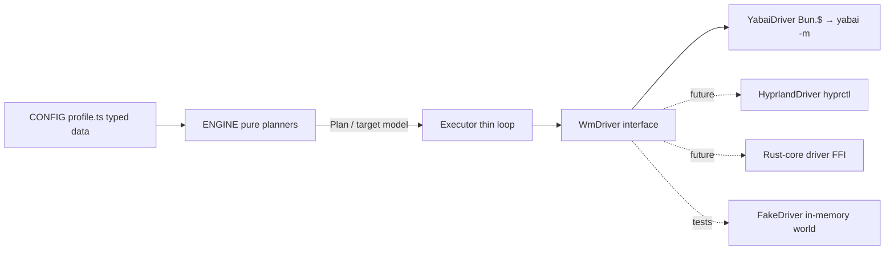

# Design — Portable TS yabai/WM config

*Design record from the bash-to-TypeScript port. Written before the rewrite;*
*the port is complete and this repository is the result. Kept as the rationale*
*behind the architecture.*

## Problem / Intent

The workspace-config stack — window placement, keybind actions, focus slots,
the laptop flex converger — was ~1800 LOC of bash across 17 files (16 `.sh`
scripts + the `yabairc` init: lib.sh 513, laptop-layout.sh 229,
apply-workspace.sh 159, profile.sh 132, laptop-flex-event.sh 123,
display-event.sh 95, yabairc 86, rules.sh 81, plus 9 smaller scripts), with
~107 yabai/jq CLI call sites. The decision (frozen in a prior session) was to
rewrite it as a TypeScript/Bun application in which the config and the layout
logic are **backend-agnostic**: yabai is one swappable driver behind an
interface, so a future Hyprland (Linux) driver or a Rust-core custom WM is a
driver swap, not a rewrite. This record designs HOW, not WHETHER.

A second, equally load-bearing goal (Matt): **config portability across
display topologies**. The eventual Hyprland rig has no laptop screen and a
different display set than the macOS G9/AW/laptop desk. Matt's framing: "the
config will need to adjust to the hyprland setup not having a laptop screen.
however having the config portable across the 2 is what will enable me to
actually try out hyprland anyway." Config portability across the two
topologies is the *enabler* that makes trying Hyprland a config+driver swap
rather than a rewrite — so topology-adaptivity is a first-class Layer-1
requirement, not an afterthought.

The bash corpus also carries two structural liabilities the rewrite removes:

- **The CLAIM_RESULT subshell footgun.** The claim resolver returns results
 "via the global CLAIM_RESULT, never command substitution — `$(...)` runs in
 a subshell where the claim set mutation would be lost". A
 real bug this convention has already caused: wrapping a claiming function in
 `$` silently discards the `_CLAIMED` mutation. In TS this is just a return
 value.
- **Two regex engines that must agree.** Window specs are matched by jq
 `test` (Oniguruma) in `win_id_claim` and bash `=~` (POSIX ERE) in
 `slug_for_window`: "the two placement-deciding matchers use different regex
 engines … and MUST agree for a flex window to land in its pinned slug's
 namespace"; profile.sh constrains every spec to the
 common subset — "Keep specs within the literal subset both interpret
 identically … Avoid engine-divergent constructs (`\d`, `\b`,
 `[[:alpha:]]`, backrefs, inline `(?i)` flags)". In TS
 both matchers collapse to one JS `RegExp` — the divergence class vanishes
 (though each WIN spec must be re-validated once against JS RegExp
 semantics; see T2).

## Approach

**Three layers, dependency-ordered CONFIG → ENGINE → DRIVER, with the engine
pure and the driver the only effectful surface.** The config and engine —
resolution logic AND layout planners — never change when the driver swaps:
the engine emits a declarative, backend-neutral layout target and each driver
realizes it (D2), so the swap-invariance promise holds literally. The driver
interface is the contract of this design (freeze timing in Global
Constraints).

Two decisions Matt ruled on after this record was red-teamed, threaded
through the layers below:

- **D1 — Space identity: opaque stable `SpaceId` handles** (Matt). Engine and
 `WmDriver` identify spaces by an opaque stable `SpaceId` minted by the
 driver, never yabai's live (renumbering) index. `moveSpaceToIndex` is the
 one legitimately index-typed method — ordering is genuinely positional.
 The driver owns the `SpaceId → live-index` bookkeeping (§Layer 3).
- **D2 — The plan is a declarative layout IR** (Matt). The engine emits a
 backend-neutral layout target (per space: label, kind, column membership,
 ratios), never yabai verbs; each driver *realizes* the target with its own
 imperative recipe and settle cadence (§Layer 3). Settle timing in plan
 data is abstract `units` scaled by the driver's `settleMs` — never
 absolute milliseconds.
- **D2-corollary — topology-portable config** (Matt). The config expresses
 layout per display topology and adapts when a named display is absent (the
 Hyprland rig has no `laptop` display). The laptop-specific machinery
 (`LAPTOP_PINNED`, `LAPTOP_STACK_APPS`, the flex converger) is
 macOS-laptop-**topology**-specific config+engine that a no-laptop topology
 simply doesn't select — it is NOT driver-coupled.



The app is a single CLI binary, working name **`tess`**, whose subcommands map
1:1 onto the original scripts (`tess apply` ≙ apply-workspace.sh, `tess laptop`
≙ laptop-layout.sh, `tess focus-slot N` ≙ focus-slot.sh, …). skhd and yabai
signals invoke `tess <subcommand>` exactly as they invoked the shell scripts
before the port.

### Layer 1 — CONFIG (`profile.ts`, typed data)

The current `profile.sh` is already "Pure data, no logic" (`profile.sh` header)
and ports to a typed TS module. The shapes, mapped 1:1 from the current
declarations:

```ts
// Logical display name → stable width in px. Width is the identity key:
// "display UUIDs/indexes are not [stable] (macOS reorders them on connect)"
// declare -A DISPLAY_W=( [g9]=5120 [aw]=3440 [laptop]=1728 )
type DisplayName = "g9" | "aw" | "laptop";
interface Profile {
 displays: Record<DisplayName, { width: number }>;
 // WIN "app-regex|title-regex" specs, split into fields.
 // `titleInvert` replaces the leading-`!` convention parsed by callers today
 // ONE regex engine: JS RegExp for both claim and slug.
 windows: Record<WindowName, WindowSpec>;
 // Desk columns: G9_LEFT=(arc) / G9_MAIN / G9_RIGHT,
 // AW_LEFT / AW_RIGHT, MBP_STACK.
 desk: DeskLayout[];
 // COL3_ROOT_RATIO=0.30 / COL3_INNER_RATIO=0.5714.
 ratios: { col3Root: number; col3Inner: number };
 // DESK_SLOTS with the name@display suffix parsed
 // into a structured field instead of string-splitting on `@`.
 deskSlots: ReadonlyArray<{ name: WindowName; onDisplay?: DisplayName }>;
 // LAPTOP_PINNED=(arc ghostty-wave arc … arc) — repeats
 // claim distinct windows, occurrence-suffixed labels.
 laptopPinned: ReadonlyArray<WindowName>;
 // LAPTOP_STACK_APPS keys are LITERAL app names.
 laptopStackApps: ReadonlySet<string>;
}
type WindowName = string; // the WIN logical names ("arc", "ghostty-wave", …)
interface WindowSpec {
 app: RegExp; // e.g. /^Arc$/ ← "Arc|" — anchoring decided per-spec at port time
 title?: RegExp; // absent = match any title (profile.sh "Empty title")
 titleInvert?: boolean; // the `!title` inversion (lib.sh "Honours the `!title` inversion")
}
interface DeskLayout {
 display: DisplayName;
 label: string; // space label: "main" | "plan" | "laptop"
 kind: "3col" | "2col" | "stack"; // apply-workspace.sh's three shapes
 columns: ReadonlyArray<ReadonlyArray<WindowName>>; // col[0] = anchor, rest stack
}
```

The config stays THE one file Matt edits (`profile.sh` "THE ONE FILE YOU
EDIT"). It is a TS module exporting `profile satisfies Profile` — typed,
compile-checked, still declarative data (no logic; see Open Questions Q2 for
data-file vs code).

**Topology adaptivity (D2-corollary):** the desk layout already binds only to
*present* displays — apply-workspace builds each desk conditionally
(`if [[ -n $g9 ]]` … `if [[ -n $aw ]]` … `if [[ -n $mbp ]]`,
`apply-workspace.sh`). The TS config makes that explicit and typed:
`desk` entries bind to `DisplayName`s and are skipped when the named display
is absent, and the laptop-topology fields (`laptopPinned`, `laptopStackApps`)
are selected only by a topology that has a `laptop` display — so a
machine/topology with a different display set (or no laptop, as Hyprland's)
is a config selection, not a code change. This is the portability goal from
Problem/Intent made concrete.

### Layer 2 — ENGINE (pure, driver-agnostic, bun:test-able)

The engine is pure functions over immutable snapshots: they take a
`WorldSnapshot` (windows/spaces/displays as queried) plus the `Profile` plus
any persisted state (the flex-order list), and return **values** — claimed
ids, slug labels, or a `Plan` (declarative layout targets + ordered
backend-neutral steps, per D2 — never driver verbs). No
engine function touches the driver, the filesystem, or the clock. This is the
pure-core / thin-shell pattern: pure functions build typed arg arrays and
parse output, and a single `$`-running export executes — so the pure parts are
unit-tested with no live subprocess.

Engine modules, each porting a named piece of lib.sh logic:

- **`matcher.ts`** — `matchesSpec(spec, win)`: the single matcher replacing
 both jq `test` and bash `=~`.
 `slugForWindow(profile, app, title)`: WIN keys iterated in explicit sort
 order (`lib.sh` iterates `printf '%s\n' "${!WIN[@]}" | sort`), fallback
 slug = app lowercased, non-alphanumerics squeezed to `-`.
- **`claim.ts`** — a `ClaimSet` class (or `claimWindow(state, …): { id?, state }`)
 porting `win_id_claim`: filter non-minimized non-floating
 (`lib.sh` `select(."is-minimized" == false and."is-floating" == false)`),
 pass 1 prefers the target display, pass 2 any unclaimed.
 CLAIM_RESULT and `_CLAIMED` become a normal return value + explicit state —
 the footgun is structurally gone.
- **`flex.ts`** — `laptopFlexPlan(profile, windows, persistedOrder)` porting
 `laptop_flex_windows`: occurrence counters seeded from
 `LAPTOP_PINNED` ("The occurrence count is SEEDED from LAPTOP_PINNED, so a
 pinned slug's flex overflow continues its sequence (a 5th Arc after 4
 pinned arcs → lap-arc-5, D10)", `lib.sh`), windows processed in id
 order, output in stable-append order. `reconcileFlexOrder(persisted, current)`
 ports `laptop_flex_order`: pure list reconciliation
 returning both the render order and the new file content (retaining absent
 slugs' lines — "retains lines for slugs not currently present so a slug's
 slot is stable across relaunch", `lib.sh`); the caller does the I/O.
- **`display.ts`** — `resolveDisplay(profile, displays): number | null`: the
 logical `DisplayName` → live display index resolver by frame width
 (`display_idx`, `lib.sh`; width-as-identity because macOS reorders
 indexes on connect, `profile.sh`), `null` when the display is absent.
 Every layout planner below resolves displays through it — the primitive the
 D2-corollary topology portability rests on.
- **`desk.ts`** — `deskPlan(profile, world)`: claims per display in
 apply-workspace order (`apply-workspace.sh` resolves "all claims up
 front (global dedup across displays)"), and emits **only** a declarative
 layout target per present display's space (D2): `{ label, kind:
 "3col"|"2col"|"stack", columns (resolved window ids), ratios }`. The engine
 emits no evacuate/park step and makes no park-target choice: the entire
 imperative realization — clearing residual windows off the target space
 (the "laptop first, else AW" park dance at `apply-workspace.sh`,
 which exists only as a yabai-Tahoe workaround: "yabai on Tahoe always
 creates on the laptop display" `lib.sh`, and `--warp` from a
 foreign space is non-deterministic), then evacuate→insert-east→ratio→
 insert-stack — is `YabaiDriver.realizeSpaceLayout`'s
 concern (§Layer 3). `realizeSpaceLayout` already receives the resolved
 window ids, so it owns residual-clearing end to end; a Hyprland driver
 realizing the same target emits no park step at all. Where the plan
 sequences steps, settles are `{ op: "settle", units }` — abstract units the
 executor scales by `driver.settleMs`, never absolute ms — pure data,
 testable.
- **`laptop.ts`** — `laptopConvergePlan(profile, world, persistedOrder)`:
 the four-phase converger (pinned core with occurrence-suffixed labels,
 flex tail, reconcile-and-re-home, order) from `laptop-layout.sh`.
 Under D1 this machinery **shrinks**: the engine holds stable `SpaceId`s, so
 "space indexes renumbered under me" ("Re-query after each destroy: space
 indexes renumber", `laptop-layout.sh`) stops being an engine-visible
 event — index bookkeeping lives in the driver, and `createSpace` returns
 the handle directly. The **step-plan** (the engine returns the next step
 given the current snapshot; the thin executor loops query→step→execute)
 survives ONLY where a genuinely new query is needed between phases (e.g.
 windows appearing mid-converge), not for index churn. The planner stays
 pure.
- **`focus.ts`, `snap.ts`** — slot resolution (`focus-slot.sh`:
 `name@display` preference, fall back anywhere) and the in-place reshape
 plans (`snap-layout.sh`: x-sorted current leaves into 3col/50-50/
 columns).

Every module above is bun:test-able with fixture snapshots (recorded yabai
query JSON) and zero mocking of effects, because effects don't exist here.

### Layer 3 — DRIVER (`WmDriver`, the load-bearing contract)

Derived from the actual yabai call-site inventory (~107 sites). Concrete TS
signatures — this section is the contract seam (soft-frozen at T1, hard at
T5 merge — see Global Constraints):

```ts
// Space identity (D1, Matt): the engine addresses spaces by an opaque stable
// `SpaceId` minted by the driver — never yabai's live index, which renumbers
// on create/destroy/move. The driver owns the id → live-index map.
type SpaceId = string & { readonly __brand: "SpaceId" };

// Snapshot types mirror the yabai query JSON fields the scripts consume
// (id/app/title/display/space/is-minimized/is-floating/is-sticky/is-visible/
// split-type/frame), normalized to camelCase, driver-translated.
interface WmWindow {
 id: number; app: string; title: string;
 displayIdx: number; spaceId: SpaceId;
 minimized: boolean; floating: boolean; sticky: boolean; visible: boolean;
 splitType: "vertical" | "horizontal" | "none";
 frame: { x: number; y: number; w: number; h: number };
}
interface WmSpace {
 id: SpaceId; label: string; displayIdx: number;
 windowIds: ReadonlyArray<number>; // ALL windows incl. minimized/sticky
 layout: "bsp" | "stack" | "float";
}
interface WmDisplay {
 idx: number; frame: { x: number; y: number; w: number; h: number };
 spaceIds: ReadonlyArray<SpaceId>; // ordered; [0] is the home space
}

type DirSel = "west" | "south" | "north" | "east";
type StackSel = "stack.next" | "stack.prev" | "stack.first" | "stack.last";
type DisplaySel = number | "next" | "prev" | "first" | "last";

interface WmDriver {
 // ── Queries (every mutator invalidates; no hidden caching in the driver —
 // snapshot caching is the executor's job, mirroring _WINDOWS_JSON /
 // win_refresh, lib.sh) ──
 queryWindows: Promise<WmWindow[]>;
 // Kept deliberately as a freshness/perf primitive (C3): a narrow
 // mid-converge re-query of ONE space is cheaper than a full
 // queryWindows; it is a separate query today for the same reason —
 // win_ids_on_space exists "so T3's re-home finds residual
 // windows the claim filter hides". Unfiltered.
 queryWindowsOnSpace(id: SpaceId): Promise<WmWindow[]>;
 querySpaces: Promise<WmSpace[]>;
 queryDisplays: Promise<WmDisplay[]>;
 queryFocusedSpace: Promise<WmSpace | null>; // ≙ query --spaces --space
 queryFocusedWindow: Promise<WmWindow | null>; // C3: replaces the old `null = focused` arg convention

 // ── Space lifecycle (SpaceId-typed, D1) ──
 // yabai --create appends an unlabelled space and returns nothing; on Tahoe
 // it "always creates on the laptop display". YabaiDriver
 // resolves the fresh index internally (set-difference idiom,
 // laptop-layout.sh), mints the SpaceId, and returns the handle —
 // dissolving the set-difference idiom at the engine layer. A driver with a
 // saner native API (Hyprland) just wraps the created workspace id.
 createSpace(displayIdx: number): Promise<SpaceId | null>;
 destroySpace(id: SpaceId): Promise<boolean>;
 labelSpace(id: SpaceId, label: string): Promise<void>;
 setSpaceLayout(id: SpaceId, layout: "bsp" | "stack" | "float"): Promise<void>;
 // The ONE index-typed space method (D1) — ordering is genuinely positional.
 moveSpaceToIndex(id: SpaceId, toIdx: number): Promise<void>; // ≙ space --move
 balanceSpace(id?: SpaceId): Promise<void>;

 // ── Layout realization (D2) ──
 // The engine's declarative target; the driver realizes it end to end with
 // its own imperative recipe + settle cadence (yabai: lib.sh;
 // Hyprland: a dispatch batch). The driver — NOT the engine — owns clearing
 // the target space first: evacuating residual windows and choosing the park
 // target ("laptop first, else AW", apply-workspace.sh) is a
 // yabai-Tahoe workaround ("always creates on the laptop display",
 // lib.sh; foreign-space `--warp` is non-deterministic), so it lives
 // here where a Hyprland driver simply omits it. The full resolved window
 // set is in `target`, so realization needs no engine-side pre-evacuation.
 realizeSpaceLayout(id: SpaceId, target: SpaceLayoutTarget): Promise<void>;

 // ── Window placement (always-explicit window ids, C3) ──
 moveWindowToSpace(winId: number, id: SpaceId): Promise<void>;
 moveWindowToDisplay(winId: number, sel: DisplaySel): Promise<boolean>;
 setSplitRatio(winId: number, absRatio: number): Promise<void>; // ≙ --ratio abs:
 toggleSplit(winId: number): Promise<void>; // ≙ --toggle split
 toggleFloat(winId: number): Promise<void>;
 armInsert(winId: number, dir: "east" | "west" | "north" | "south" | "stack"): Promise<void>; // keybind surface (`tess insert`) — NOT engine vocabulary under D2 (lib.sh 410)
 stackOnto(targetWinId: number, winId: number): Promise<void>; // Hyprland has no insert-arm; yabai impl = armInsert+move
 swapWindows(sel: DirSel): Promise<boolean>;
 warpWindow(sel: DirSel): Promise<boolean>;
 resizeWindow(edge: "left" | "right" | "top" | "bottom", dx: number, dy: number): Promise<boolean>; // ≙ resize-column.sh, skhdrc arrows

 // ── Focus ──
 focusWindow(winId: number): Promise<boolean>;
 focusWindowDir(sel: DirSel | StackSel): Promise<boolean>;
 focusDisplay(sel: DisplaySel): Promise<boolean>;

 // ── Optional capabilities (undefined = unsupported on this backend) ──
 rules?: WmRuleOps; // rules.sh's arrival routing — yabai-specific shape
 events?: WmEventSource; // signal subscription — used by `tess init` wiring
 settleMs: number; // base settle unit; {op:"settle",units} sleeps units × settleMs (yabai: 150). No absolute ms in plan data (D2).
}
// The declarative layout target (D2): backend-neutral intent the driver
// realizes. columns hold resolved window ids; col[0] is the anchor, the
// rest stack (from DeskLayout post-claim).
interface SpaceLayoutTarget {
 kind: "3col" | "2col" | "stack";
 columns: ReadonlyArray<ReadonlyArray<number>>;
 ratios?: { root: number; inner: number }; // COL3 ratios from Profile
}
interface WmRuleOps {
 list: Promise<Array<{ label: string }>>;
 remove(label: string): Promise<void>;
 add(rule: { label: string; app?: string; subrole?: string;
 displayIdx?: number; spaceIdx?: number; manage?: boolean }): Promise<void>;
 apply: Promise<void>;
}
interface WmEventSource {
 register(event: WmEvent, command: string[]): Promise<void>; // yabai: signal --add action=…
}
type WmEvent =
 | "display_added" | "display_removed" | "display_moved"
 | "application_launched" | "application_terminated"
 | "window_created" | "window_destroyed"
 | "space_changed" | "display_changed" | "dock_did_restart";
```

Shape decision: **one `WmDriver` object, internally segmented, with optional
capability sub-interfaces** (`rules`, `events`) rather than N independent
interfaces threaded separately — see Alternatives. Failure convention:
mutators that the scripts today guard with `|| true` (nearly all — e.g.
`apply-workspace.sh` suffixes every yabai call `2>/dev/null || true`) return
`Promise<boolean>`/resolve-on-failure rather than throw; queries throw only on
driver-gone (yabai not running), which callers surface as a clean exit.

**YabaiDriver** is the only impl now: `Bun.$` to `/opt/homebrew/bin/yabai -m …`
(absolute path, as `lib.sh` pins `YABAI=/opt/homebrew/bin/yabai`),
`JSON.parse` replacing every jq program. jq disappears as a dependency. Under
D1, YabaiDriver owns the **`SpaceId → live-index` map** — the same
set-difference bookkeeping the scripts already do to discover a fresh space's
index moved one layer down. Stated honestly: the
map is driver-internal **mutable state** that must stay synced with yabai's
renumbering (invalidated/refreshed on every create/destroy/move) — the
YabaiDriver's one stateful concern, and a named FakeDriver test target in T5
(destroy renumbers the underlying index; the stable id survives). Under D2,
`realizeSpaceLayout` carries the imperative column recipe — evacuate →
insert-east anchors L→R → set ratios → insert-stack extras
— plus the driver's **settle profile** (the empirical 0.4/0.15/0.35s
durations, `lib.sh`) as driver-owned timing; no absolute milliseconds
appear in engine plan data. The **Hyprland seam** is documented, not built:
`hyprctl -j` covers the query surface; workspaces/dispatchers cover
space+window ops; `armInsert` has no Hyprland analogue — which is fine: under
D2 a HyprlandDriver realizes the SAME `SpaceLayoutTarget` with a dispatch
batch, and `armInsert`/`stackOnto` remain only as keybind-facing primitives
(`tess insert`; Hyprland: group management). A future Rust-core
(CoreGraphics/SkyLight FFI) driver implements the same interface via FFI
instead of a subprocess.

### Effectful shell around the engine

Four thin effectful pieces, each isolated and small:

- **Executor**: runs a `Plan` against the driver — the only place
 settle sleeps happen (`Bun.sleep(units * driver.settleMs)`); re-queries
 between step-plan phases.
- **State**: the flex-order file
 (`${XDG_CACHE_HOME:-~/.cache}/yabai/laptop-flex-order`, `lib.sh`) —
 read/write only; reconciliation logic is pure in `flex.ts`.
- **Notify**: fire-and-forget status-bar nudge —
 `sketchybar --trigger <event>` at the absolute path
 (`SKETCHYBAR=/opt/homebrew/bin/sketchybar`, `lib.sh`) with `|| true`
 semantics: never throws, no-op if sketchybar is absent. Called by
 `tess laptop` after every converge ("Nudge sketchybar to re-read space
 labels now that the grid is (re)built … Harmless no-op if sketchybar isn't
 running" — `"$SKETCHYBAR" --trigger yabai_spaces_changed 2>/dev/null ||
 true`, `laptop-layout.sh`), by `tess display-event` once the
 topology is stable (`"$SKETCHYBAR" --trigger display_relatch 2>/dev/null
 || true`, `display-event.sh`). A third call site — `tess apply` after a
 lap-* teardown mutates the space list — is an **intentional new trigger**,
 not a ported one: `apply-workspace.sh` has no sketchybar call today (only
 the TODO comment at `apply-workspace.sh`), and `teardown_laptop_grid`
 changes the space set the bar shows, so nudging there closes a known stale-
 bar gap. Flagged explicitly as the one behavior addition in this effect (the
 Global-Constraints parity rule requires naming it); it can be dropped to
 strict parity if the existing `space_changed` signal proves sufficient. A
 status-bar concern, deliberately OUTSIDE `WmDriver`.
- **Coordination**: ports of the /tmp mkdir-locks
 with stale-PID reclaim,
 the stamp-file debounce waiters (`display-event.sh`,
 `laptop-flex-event.sh` incl. the H7 display-quiet gate and the H2
 re-stamp-on-guard/re-loop-on-contention rules), and the TTL'd signal guard
 (`lib.sh`, `GUARD_TTL=8`, re-stamped at phase boundaries —
 `apply-workspace.sh`, `laptop-layout.sh`). Same on-disk
 protocol and paths as today so a mid-cutover mixed state can't deadlock.
 The event model stays spawn-per-signal + background waiter (no resident
 daemon in v1 — Open Questions Q3).

### CLI surface (what skhd and yabai signals call)

One binary, subcommands replacing scripts 1:1:

| today (`skhdrc` / `yabairc` / signals) | tomorrow |
| --- | --- |
| `apply-workspace.sh` (skhdrc Kp0 + cmd+alt-a; yabairc startup; display-event cascade) | `tess apply` |
| `laptop-layout.sh` | `tess laptop` |
| `display-event.sh` (3 display signals, yabairc) | `tess display-event` |
| `laptop-flex-event.sh` (4 app/window signals, yabairc) | `tess flex-event` |
| `rules.sh` | `tess rules` |
| `display-setup.sh` | `tess display-setup` |
| `focus-slot.sh N` (Kp1-9) | `tess focus-slot N` |
| `snap-layout.sh 3col\|50-50\|columns` (KpDivide/KpMultiply/KpClear) | `tess snap 3col\|50-50\|columns` |
| `stack-cycle.sh next\|prev` (KpDecimal) | `tess stack-cycle next\|prev` |
| `resize-column.sh grow\|shrink` (KpPlus/KpMinus) | `tess resize grow\|shrink` |
| `move-to-display.sh g9\|aw\|laptop` (ctrl+alt-1/2/3) | `tess move-display g9\|aw\|laptop` |
| `cycle-display.sh next\|prev` (ctrl+alt-h/l) | `tess cycle-display next\|prev` |
| `reset-splits.sh` / `columns.sh` (cmd+alt-0x18 / cmd+alt-c) | `tess reset-splits` / `tess columns` |
| raw `yabai -m window --focus west` one-liners (skhdrc Focus/Move/Stack blocks) | `tess focus west`, `tess swap west`, `tess insert stack`, … (Q6) |

`yabairc` stays a file yabai execs as shell (that contract is yabai's), but
shrinks to a thin shim, all of it yabai-driver config correctly OUTSIDE the
portable app: the `yabai -m config` settings lines, plus the two
scripting-addition load lines verbatim — `yabai -m signal --add
event=dock_did_restart action="sudo yabai --load-sa"` and the bare startup
`sudo yabai --load-sa` (both in `yabairc`). The bare startup load is neither a
`-m config` line nor a `tess` subcommand, so it must be named explicitly: it
loads the scripting addition at boot (the `dock_did_restart` re-load only
fires on a later dock restart), and without it the sudo-gated features are
dark until the first dock restart. After those, `exec tess init` registers all
signals via `driver.events.register` and runs the startup cascade
(`display-setup` → `rules` → `apply`, as `yabairc` does today).

The two sketchybar signal registrations ride the same path: `tess init`
registers them via `WmEventSource.register(event, command)` as plain
external commands — today `yabairc` registers
`space_changed`/`display_changed` → `action="$SKETCHYBAR --trigger
yabai_spaces_changed"`, guarded by `[[ -x $SKETCHYBAR ]]`. Event wiring
whose action is an external command, correctly OUTSIDE `WmDriver` (a
status-bar concern, not a WM op).

### Testing

- **Engine**: pure bun:test units — claim preference passes, slug fallback,
 occurrence seeding (the 5th-Arc → `lap-arc-5` case, `lib.sh`),
 stable-append retention, desk layout-target goldens, converge step-plans.
 Fixtures = recorded `yabai -m query` JSON from the live machine.
- **Driver**: a `FakeDriver` implementing `WmDriver` over an in-memory world
 model (spaces renumber on destroy while their stable `SpaceId`s survive —
 the D1 map's named test — create-appends-on-laptop-display; encode yabai's
 observed quirks) lets the executor+engine converge end-to-end
 in tests. YabaiDriver itself gets arg-construction tests (the exact
 `yabai -m …` argv per method — same shape as `deploy.test.ts` testing
 `wranglerArgs`) plus parse tests against the recorded fixtures.
- **Config**: `tsc --noEmit` is the schema check; one test validates every
 WIN spec compiles as JS RegExp and matches its recorded live windows
 (the re-validation the engine collapse requires).

### Build + deploy

The app builds to a **single, self-contained compiled binary on PATH**:

- The app is written with a **zero-npm-dependency policy** (`Bun.$`,
  `JSON.parse`, and `node:util` `parseArgs` cover everything jq/bash did).
  Zero runtime deps keep packaging trivial — `bun build --compile
  src/index.ts --outfile tess` embeds the Bun runtime and emits a drop-in
  `tess` on PATH, with no lockfile/node_modules fetch phase. (See this repo's
  `package.json` `build` script.)
- Deploy = put the compiled `tess` binary somewhere on your PATH and wire your
  `skhdrc` and `yabairc` to call `tess <subcommand>`. On macOS, launchd's
  minimal PATH is why yabai/skhd hooks tend to pin an absolute path — so the
  skhdrc/yabairc references can use the binary's absolute path or a bare name
  once PATH is set.
- Iteration loop: edit → `bun run src/index.ts <subcommand>` runs the sources
  directly with no rebuild; compile to a binary when you deploy.

## Alternatives considered

- **Incremental port (script-by-script, bash and TS coexisting long-term).**
 Rejected — Matt's frozen decision is a full TS rewrite. It would also be
 technically poor here: the shared state (`_CLAIMED` claim set, the flex-order
 file, the signal guard, the locks) crosses script boundaries, so a half-bash
 half-TS system would need the TS side to speak the bash conventions
 (CLAIM_RESULT and both regex engines included) — preserving exactly the
 liabilities the rewrite removes. The plan below still lands in reviewable
 slices, but the *cutover* is atomic (one switch flips skhdrc + yabairc +
 signals to `tess`).
- **Rust core now.** Rejected per skill://rust-capability-bar: the bar is a
 capability Go/TS genuinely lack, never ergonomics. The engine is pure list/
 regex/ordering computation; the config is data; the frontend is a CLI that
 shells out — Bun covers all three. The only component that could ever clear
 the bar is a hypothetical future FFI-heavy *driver* (CoreGraphics/SkyLight,
 if Apple breaks yabai and fork-maintenance fails — Matt's stated fallback
 ladder: yabai → fork-and-maintain → Rust-core driver). The `WmDriver`
 interface is precisely the seam that makes that a driver swap later, so
 designing the Rust core now buys nothing and is out of scope.
- **Driver-abstraction shape: N independent capability interfaces**
 (`WindowQuery`, `SpaceOps`, `FocusOps`, … injected separately) vs the chosen
 **one `WmDriver` with optional capability fields**. Fully-segmented
 interfaces make partial backends explicit but force every call path to
 thread several objects and invent a composition story for two drivers that
 will in practice always implement the whole core. Chosen: one interface for
 the universally-portable core (queries, spaces, placement, focus), with
 `rules?`/`events?` optional for the genuinely backend-shaped parts. A
 backend lacking a core method has no useful config to run anyway.
- **Porting jq semantics wholesale (keep Oniguruma via a WASM/oniguruma dep,
 bug-for-bug spec compatibility).** Rejected: the WIN specs are constrained
 to the engines' common literal subset *by documented rule*, so JS RegExp already accepts them; a one-time
 re-validation test (T2) is cheaper and removes a dependency class the
 zero-dep policy forbids.
- **Resident daemon subscribing to yabai signals** (one long-lived `tess daemon`
 process replacing the stamp/lock/waiter machinery with in-process
 debouncing). Genuinely simpler concurrency model — the mkdir-locks,
 stale-PID reclaim, and stamp files exist only because every event spawns a
 fresh shell. Deferred, not adopted, for v1 (Open Questions Q3): the
 spawn-per-event model is battle-tested on this exact machine, keeps `tess`
 crash-free-by-construction (no long-lived process to die silently), and
 porting the existing protocol is mechanical. The daemon becomes attractive
 the moment a second event consumer appears.

## Plan

App root: this repository (sources under `src/`, tests colocated `*.test.ts`,
`index.ts` the CLI entry).

### Global Constraints

- **Runtime/tooling:** Bun; TypeScript strict; Biome; `bun:test`. Zero npm
  dependencies (Bun builtins + `node:` core only) — keeps packaging a plain
  `bun build --compile` with no lockfile plumbing.
- **Layering is law:** `config/` and `engine/` import nothing from `driver/`
 or `effects/`; `engine/` is pure (no I/O, no clock, no globals). Every
 effect goes through `WmDriver` or the named effect modules (state, locks,
 executor).
- **The `WmDriver` interface in Approach §Layer 3 is the contract** all tasks
 inherit. T1 lands it as a **soft freeze** (C2): T5's PR — the first real
 driver — is explicitly allowed to adjust the contract, because interface
 flaws are characteristically discovered writing the first real driver. The
 **hard freeze (amendment-gated) takes effect when T5 merges.** An executor
 hitting a T5-discovered interface flaw neither stalls on amendment ceremony
 nor silently violates the freeze.
- **Behavior parity over cleanup:** each port task reproduces the cited
 current behavior (including settle sleeps, lock protocols, guard TTLs, and
 on-disk paths — `laptop-flex-order`, `/tmp/yabai-*.lock|stamp|guard`)
 unless this record explicitly changes it. No opportunistic redesign.
- **Deploy:** `bun build --compile` to a single binary on PATH; skhd/yabairc
  call `tess <subcommand>`.
- **VCS:** jj + jj-vine, one PR per task slice where practical; design frozen
 on merge of this record's PR.

### T1 — Scaffold + config types + driver interface

Create the source tree with tsconfig (strict), Biome config, and:

- `src/config/types.ts` — `Profile`, `WindowSpec`, `DeskLayout`,
 `DisplayName`, `WindowName` exactly as Approach §Layer 1.
- `src/config/profile.ts` — the ported data: `DISPLAY_W`,
 all 10 `WIN` specs as `RegExp` pairs with
 `titleInvert` for a future `!` spec (none exist today — all current titles
 are plain: `pc`, `mbp`, empty), `G9_*`/`AW_*`/`MBP_STACK` as `desk` entries with labels `main`/`plan`/`laptop`
 (labels from `apply-workspace.sh`), ratios, `DESK_SLOTS`, `LAPTOP_PINNED` + `LAPTOP_STACK_APPS`.
- `src/engine/display.ts` — `resolveDisplay(profile, displays): number | null`:
 the logical `DisplayName` → live macOS display index resolver, matching by
 frame width because "display UUIDs/indexes are not [stable] (macOS reorders
 them on connect)"; ports `display_idx` ("`<logical-name>`
 → live macOS display index, or empty if not connected", `lib.sh`),
 returning `null` for an absent display (the topology-portability primitive
 the D2-corollary rests on — a no-laptop rig resolves `laptop` to `null` and
 its layout is simply not selected). Pure: takes the `queryDisplays`
 snapshot, touches no driver.
- `src/driver/types.ts` — `SpaceId`, `WmDriver`, `WmWindow`, `WmSpace`,
 `WmDisplay`, `SpaceLayoutTarget`, `WmRuleOps`, `WmEventSource`, selector
 types, verbatim from Approach §Layer 3.

Interfaces:

- Produces: `config/types.ts` (exports above), `config/profile.ts`
 (`export const profile: Profile`), `driver/types.ts` (the contract —
 soft-frozen until T5 merges, per Global Constraints).
- Consumes: the original `profile.sh` (read-only source of truth for values).
  No behavior yet; `tsc --noEmit` + Biome green is the gate.

### T2 — Matcher + claim engine (+ WIN re-validation)

- `src/engine/matcher.ts` — `matchesSpec(spec: WindowSpec, app: string,
 title: string): boolean` (single-engine port of `lib.sh` and
 `lib.sh`); `slugForWindow(profile: Profile, app: string, title:
 string): string` (sorted-key iteration, `lib.sh`; fallback slug
 squeeze, `lib.sh`).
- `src/engine/claim.ts` — `class ClaimSet { claim(windows: WmWindow[],
 name: WindowName, preferDisplay?: number): number | null; claimMany(...):
 number[]; }` porting `win_id_claim`/`win_ids_claim`:
 non-minimized+non-floating filter, prefer-display pass, any-unclaimed pass,
 claimed-set threading as instance state — returns values, no globals.
- Tests: claim preference/dedup/absence; slug fallback + the
 Ghostty|pc vs Ghostty|mbp title disambiguation (the latent-bug fix noted at
 sibling design D10); a **WIN re-validation test** asserting every
 `profile.ts` RegExp both compiles and classifies a recorded live-window
 fixture identically to the documented bash behavior.

Interfaces:

- Consumes: `config/types.ts`, `driver/types.ts` (`WmWindow` only).
- Produces: `matchesSpec`, `slugForWindow`, `ClaimSet` with the signatures
 above; fixture `src/engine/fixtures/windows.live.json` (one recorded
 `yabai -m query --windows` capture).

### T3 — Flex + laptop-converge engine

- `src/engine/flex.ts` — `reconcileFlexOrder(persisted: string[], current:
 string[]): { order: string[]; toPersist: string[] }` (port of
 `laptop_flex_order`, `lib.sh`; retains absent lines);
 `laptopFlexWindows(profile, windows, claimed: ReadonlySet<number>):
 Array<{ id: number; label: string }>` (port of `laptop_flex_windows`,
 `lib.sh`: pinned-seeded occurrence counters, id-order processing,
 stable-append composition).
- `src/engine/laptop.ts` — `laptopConvergeStep(profile, world: WorldSnapshot,
 state: ConvergeState): ConvergeAction | { done: true }` — the four-phase
 converger as a resumable step-planner: pinned
 claims with occurrence-suffixed labels,
 find-or-create per label (`createSpace` returns the `SpaceId` handle
 directly, D1), flex tail, reconcile (re-home via the narrow
 `queryWindowsOnSpace` re-query, then destroy — under D1 with NO re-query
 for index renumbering: the engine holds stable `SpaceId`s and the
 step-plan re-queries only where genuinely new information appears, e.g.
 windows arriving mid-converge), order pass (`laptop-layout.sh`
 single left-to-right insertion, realized via `moveSpaceToIndex` — the one
 index-typed call), home-space label+stack re-asserts.
- Tests: the 5th-Arc → `lap-arc-5` seed case; stable-append
 across simulated relaunches; converge step sequences against fixture worlds
 (stable `SpaceId`s throughout — renumbering is driver-internal under D1).

Interfaces:

- Consumes: T2's `ClaimSet`/`slugForWindow`; `WorldSnapshot`
 (`{ windows: WmWindow[]; spaces: WmSpace[]; displays: WmDisplay[] }`,
 defined here in `engine/world.ts`).
- Produces: the three functions above + `ConvergeAction` union
 (`createSpace`, `labelSpace`, `moveWindow`, `destroySpaceAfterRehome`,
 `moveSpace`, `setLayout`, `settle` variants — `SpaceId`-typed per D1;
 `settle` carries abstract `units` scaled by `driver.settleMs`, D2).

### T4 — Desk/snap/focus engine

- `src/engine/desk.ts` — `deskPlan(profile, world): PlanOp[]` porting
 apply-workspace's engine-side logic only: up-front global claims, display resolution via `resolveDisplay` (T1),
 teardown/reap preludes as backend-neutral ops,
 and one `SpaceLayoutTarget` (D2) per present desk space
 (`{ label, kind, columns: resolved ids, ratios }`). The engine emits **no**
 evacuate/park op and makes **no** park-target choice: both the "laptop
 first, else AW" park selection and the
 imperative anchors-insert-east→ratios→stack-extras sequence with its empirical settle durations (0.4s anchor, 0.15s
 insert/ratio, 0.35s extra — `lib.sh`) are `YabaiDriver`'s to realize
 inside `realizeSpaceLayout` (T5), since they exist only as yabai-Tahoe
 workarounds. A Hyprland driver realizing the same target
 emits neither.
- `src/engine/reap.ts` — `straySpaces(world): number[]` porting the
 `reap_stray_spaces` candidate rule (`lib.sh`: unlabelled, no
 non-sticky window, not last-on-display) and `teardownLabels(world,
 prefix)`.
- `src/engine/snap.ts` — x-sorted leaves → 3col/50-50/columns plans; `src/engine/focus.ts` — `resolveSlot(profile,
 world, n): number | null` (`focus-slot.sh`: `@display` preference then
 anywhere).
- Tests: layout-target goldens for full/partial app sets ("Missing windows are
 skipped", `apply-workspace.sh`); stray-space rule truth table incl.
 the sticky-floater case.

Interfaces:

- Consumes: T2/T3 engine modules; `PlanOp` union defined in
 `engine/plan.ts` (superset of `ConvergeAction`).
- Produces: `deskPlan`, `straySpaces`, `snapPlan(mode, world)`,
 `resolveSlot` with the signatures above.

### T5 — YabaiDriver + executor + FakeDriver

- `src/driver/yabai.ts` — `class YabaiDriver implements WmDriver`: pure
 arg-builder functions per method (`yabaiArgs.queryWindows → ["-m",
 "query","--windows"]`, …) + one thin `Bun.$` runner (pure-core / thin-shell
 split); JSON normalization (kebab yabai fields → `WmWindow`);
 the **`SpaceId → live-index` map** (D1) — minted on `createSpace` via the
 set-difference resolution, invalidated/refreshed
 on every create/destroy/move — the driver's one stateful concern;
 `realizeSpaceLayout` (D2) carrying the evacuate→insert-east→ratio→
 insert-stack recipe and the driver settle profile
 (`lib.sh` durations expressed as multiples of `settleMs`);
 `rules` + `events` impls (`rules.sh` verbs; `yabai -m signal --add`).
- `src/exec.ts` — `runPlan(driver, plan)` (settles via
 `Bun.sleep(units * driver.settleMs)`) and `runConverge(driver, stepFn)`
 (query→step→execute loop).
- `src/driver/fake.ts` — `FakeDriver`: in-memory world with yabai quirks
 (destroy renumbers the underlying index while the stable `SpaceId`
 survives — the D1 map's named test; create appends on a fixed display;
 label survives only until "restart"). Used by executor/converge
 integration tests.
- Tests: argv goldens per driver method; normalization against the T2 live
 fixture; end-to-end converge on FakeDriver reaching a fixed point
 (idempotency — running twice changes nothing).

Interfaces:

- Consumes: `driver/types.ts`, `engine/plan.ts`.
- Produces: `YabaiDriver` (ctor takes `{ yabaiPath?: string }`, default
 `/opt/homebrew/bin/yabai`), `FakeDriver`, `runPlan`, `runConverge`.

### T6 — CLI + coordination (locks/debounce/guard) + event commands

- `src/index.ts` — subcommand router (`node:util` parseArgs) for the full
 CLI table in Approach; simple commands (`focus`, `swap`, `stack-cycle`,
 `resize`, `move-display`, `cycle-display`, `reset-splits`, `columns`) are
 direct driver calls with the current fallback chains (`stack-cycle.sh`:
 next→first; `cycle-display.sh`: dir→first/last; `resize-column.sh`:
 right-edge else left-edge).
- `src/effects/locks.ts` — mkdir-lock with pidfile + stale-PID reclaim; `src/effects/debounce.ts` — stamp+waiter with
 H2 re-stamp-on-guard / re-loop-on-contention and the H7 display-quiet gate
 (`laptop-flex-event.sh`, QUIET_SECS 2/3 kept in one constants
 module so they cannot drift); `src/effects/guard.ts` — TTL'd signal guard. Same /tmp paths as today.
- **The `acted_on` capture invariant (must-preserve).** The flex waiter
 captures the stamp value *inside* the quiet loop (`acted_on` read at
 `laptop-flex-event.sh`), at the instant the quiet condition passes — the
 code comment is explicit that "re-reading STAMP after the loop would reopen
 a race where an event landing between the break and the read silently
 re-anchors us to a still-settling window set" (`laptop-flex-event.sh`,
 quote at `:82`). The T6 "factor debounce pure with fake clocks" refactor is
 exactly what could reorder that read and lose the invariant while every
 fake-clock test still passes, so it is a named invariant here, not an
 incidental ordering.
- `tess apply` (lock at `apply-workspace.sh` + guard phase re-stamps,
 `apply-workspace.sh`), `tess laptop` (contended-exit-nonzero
 contract, `laptop-layout.sh`),
 `tess display-event`, `tess flex-event`, `tess rules`, `tess display-setup`,
 `tess init` (yabairc body: config is left in yabairc; init registers the 10
 signal wirings from `yabairc` and runs setup→rules→apply).
- Tests: lock reclaim + contention exit codes on temp dirs; debounce settle
 logic with fake clocks factored pure where possible — including a named
 regression test that injects an event *between* quiet-satisfaction and
 rebuild completion and asserts the `acted_on` value captured is the
 in-loop one (guards the capture invariant above).

Interfaces:

- Consumes: everything above.
- Produces: the `tess` CLI (exit codes: `tess laptop` nonzero on live-lock
 contention, 0 otherwise — callers re-loop, `display-event.sh`);
 `effects/` modules.

### T7 — package + skhdrc/yabairc rewire

- Package the app as a single compiled binary: `bun build --compile
  src/index.ts --outfile tess`, zero deps → no fetch phase. Put `tess` on
  PATH.
- `skhdrc`: every shell-script hook and raw `/opt/homebrew/bin/yabai`
  one-liner → the corresponding `tess` subcommand per the CLI table (raw-yabai
  lines were ported to `tess` for driver portability).
- `yabairc`: shrink to config lines + a signal-free shim ending in
  `tess init` (Approach §CLI).
- Verify a compiled build and a numpad smoke on the live machine.

Interfaces:

- Consumes: T6's CLI contract.
- Produces: the packaged binary, rewired `skhdrc`, shrunk `yabairc`.

### T8 — Cutover + deletion

After a soak on the live machine (desk apply, laptop converge, a plug/unplug
cycle, numpad pad): delete the 16 ported `.sh` files (`yabairc` stays as the
shim) and rewrite the yabai README to describe the TS app.

*Historical note: in the original monorepo the shell scripts were exempted by
a `no-bash-gate` allowlist; the cutover removed those rows as the scripts were
deleted. That gate does not exist in this repository — the port is complete.*

**T7→T8 is the staged parity period, and it has named exit criteria.** T7
deploys the `tess` binary live while the ported `.sh` files still exist on disk
— so the two coexist and rollback is cheap and total. T8 (the deletions) only
proceeds once the soak passes an explicit checklist — **desk apply** on the
G9/AW rig, a full **laptop converge**, a **plug/unplug cycle** (display attach +
detach), and the **numpad pad** keybind sweep — held for a **minimum of one
full working day** of ordinary use with no flex/desk regression. Without named
criteria "after a soak" degrades to "immediately", and the first unplug-storm
race would land with the `.sh` corpus already deleted and no cheap rollback.

Interfaces:

- Consumes: T7 deployed and soaked.
- Produces: deletions above + README rewrite.

## Tasks

- [ ] T1 — scaffold the source tree; `config/types.ts` +
  `config/profile.ts` (ported profile.sh data) + `driver/types.ts`
  (frozen `WmDriver`).
- [ ] T2 — `engine/matcher.ts` + `engine/claim.ts` (single-RegExp matcher,
 ClaimSet) + WIN-spec re-validation test + live windows fixture.
- [ ] T3 — `engine/flex.ts` + `engine/laptop.ts` (stable-append, occurrence
 seeding, four-phase converge step-planner) + tests.
- [ ] T4 — `engine/desk.ts` + `engine/reap.ts` + `engine/snap.ts` +
 `engine/focus.ts` (plan builders) + op-sequence golden tests.
- [ ] T5 — `driver/yabai.ts` (arg builders + thin runner) + `driver/fake.ts` +
  `exec.ts` + argv/normalization/idempotency tests.
- [ ] T6 — `index.ts` CLI + `effects/` (locks, debounce, guard) + event
 subcommands + `tess init`.
- [ ] T7 — bun-compile package; rewire skhdrc + yabairc shim; compiled build +
  live smoke.
- [ ] T8 — cutover: delete `.sh` files; README rewrite.

## Open Questions

Batched for Matt; each carries a recommendation and whether it blocks the
plan's shape (load-bearing) or only a task's detail. Two originally-open
load-bearing forks are now **decided** and folded into Approach, so they are
not relisted here: **Q8 — space identity → Decided: D1** (opaque stable
`SpaceId` handles); **Q9 — swap-invariance scope → Decided: D2** (declarative
layout IR). The seven below remain recommendations for Matt's PR-time review.

1. **Deploy mechanism** *(non-load-bearing — T7 detail)*: a `bun build
  --compile` single binary (recommended: hermetic, zero-dep so packaging is
  trivial) vs `bun run` of the checked-out sources via a wrapper script
  (faster iteration, no rebuild per edit, but depends on the repo checkout
  path and a live bun at runtime). **Recommend: compiled binary**, with `bun
  run src/index.ts` remaining trivially available for local iteration.
2. **Config as data vs code** *(non-load-bearing)*: keep `profile.ts` a
 single declarative `satisfies Profile` module (recommended — preserves
 "THE ONE FILE YOU EDIT", diff-reviewable) vs allowing computed config
 (imports, helpers). **Recommend: pure data module**; the type system
 already gives validation, and logic in config erodes the config/engine
 boundary.
3. **Event machinery: port the stamp/lock/waiter protocol vs a resident
 daemon** *(load-bearing for T6's size)*: v1 ports the existing
 spawn-per-signal + debounced-waiter + /tmp-lock protocol byte-compatible
 (recommended — battle-tested semantics incl. H2/H7, no new failure mode,
 mixed-state-safe during cutover) vs `tess daemon` subscribing once and
 debouncing in-process (simpler code, but introduces a long-lived process
 that can die silently and needs launchd supervision). **Recommend: port
 the protocol now; revisit the daemon as its own design if the event
 surface grows.** A second trigger condition for the daemon: each signal
 spawn of a ~50MB bun-compiled binary carries real startup I/O the bash+jq
 scripts don't — if window churn ever makes that per-event latency felt,
 that (alongside "a second event consumer appears") is when the resident
 daemon earns its supervision cost.
4. **Driver-layer test strategy** *(non-load-bearing — T5 detail)*:
 FakeDriver in-memory world + argv goldens (recommended) vs
 recorded-transcript replay of real yabai sessions (higher fidelity,
 brittle to re-record). **Recommend: FakeDriver + argv goldens + one live
 fixture for parse normalization**; add transcript replay only if a
 FakeDriver-missed bug actually occurs.
5. **Keep skhd vs move keybinds into the app** *(load-bearing for scope)*:
 keep skhd dispatching to `tess` subcommands (recommended — skhd is a solid
 macOS-only concern exactly like yabai, i.e. a "driver-side" component;
 Hyprland has native binds, so keybinds are inherently per-backend) vs
 `tess` grabbing hotkeys itself (requires macOS event-tap FFI — new
 capability surface, likely the Rust-bar territory this design explicitly
 avoids). **Recommend: keep skhd**; treat the skhdrc as per-backend config
 the way yabairc is.
6. **Raw one-liner keybinds** *(non-load-bearing — T7 detail)*: skhdrc lines
 that call yabai directly (focus west, swap, insert, toggle float,
 balance) — port to `tess focus west` etc. (recommended: full driver
 portability, one dispatch surface) vs leave as raw yabai calls (fewer
 process hops; but splits the keybind surface across two backends-worth of
 syntax). **Recommend: port them all to `tess`.**
7. **Regex anchoring at port time** *(non-load-bearing — T1/T2 detail)*: WIN
 app specs today are unanchored substrings under jq `test` (`"Arc|"`
 matches any app containing "Arc") while `rules.sh` uses anchored `^Arc$`
 forms. Porting verbatim keeps substring semantics; anchoring is stricter
 and closer to intent. **Recommend: port verbatim (substring), assert
 behavior in the T2 re-validation test, and tighten anchoring later as a
 config-only change.**
